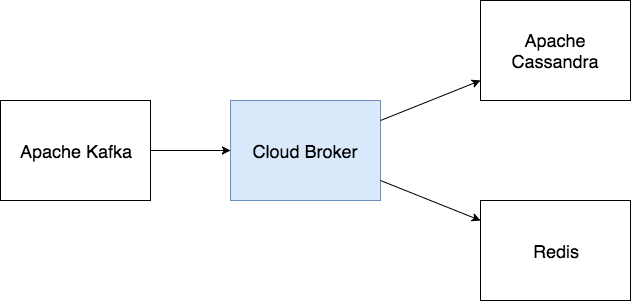

# Cloud Broker
An essential service of the Streamr cloud architecture responsible for message brokering. Listens to Apache Kafka for
new data and forwards it to Apache Cassandra (for long-term persistence) and Redis (for immediate consumption
by Streamr's engine-and-editor).

## Building

Project uses Gradle for build automation. We provide sensible default configurations for IntelliJ IDEA but project can be developed with other IDEs as well.

- Use Gradle task `test` to run tests.
- Use Gradle task `shadowJar` to build project into a Jar.

## Running
In most cases, you will want to run this service as a [pre-built Docker image](https://hub.docker.com/r/streamr/broker/).
See https://github.com/streamr-dev/streamr-docker-dev for more information on how to run the Streamr cloud architecture.

If you are developing this service in particular, or are otherwise inclined, you can run this service by running method
`main` of `com.streamr.broker.Main` via your IDE.

## Publishing
A [Docker image](https://hub.docker.com/r/streamr/broker/) is automatically built and pushed to DockerHub when commits
are pushed to branch `master`.

Currently project has no CI system configured nor are any .jar artifacts published to central repositories. 

## Performance test

The performance test is implemented in class `PerformanceTest.java`. Before
each test case we set up a fresh Kafka and Cassandra. The data is first pushed
to Kafka and then `Main.java#main` is invoked to start the broker process. The
data is pushed in advance to ensure that possible slowness of data generation 
process does not affect results.

|Method                 | Total data | Queue size | Small payload (90%) | Large payload (10%) | Total messages | Write (kb/s)| msg / s |
|-----------------------|------------|------------|---------------------|---------------------|----------------|-------------|---------|
| CassandraRepoter      | 3941 MB    | 2000       | 100-400 bytes       | 2500-72000 bytes    | 1 000 000      | 40 000kb/s  | 10 300  |
| CassanraBatchReporter | 7886 MB    | 2000       | 100-400 bytes       | 2500-72000 bytes    | 2 000 000      | 97 000kb/s  | 23 000  |
| CassanraBatchReporter | 7890 MB    | 20000      | 100-400 bytes       | 2500-72000 bytes    | 2 000 000      | 97 000kb/s  | 25 000  |

## License

This software is open source, and dual licensed under [AGPLv3](https://www.gnu.org/licenses/agpl.html) and an enterprise-friendly commercial license.
